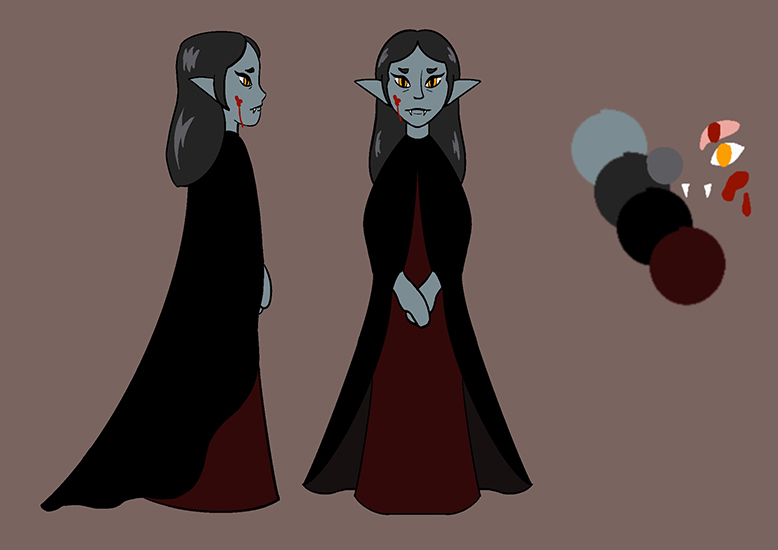
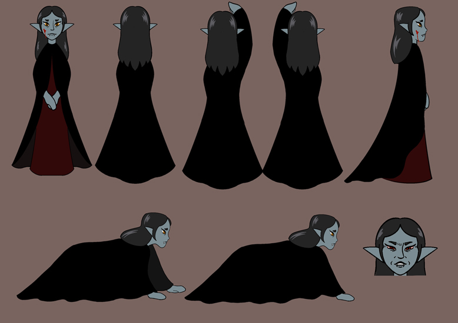
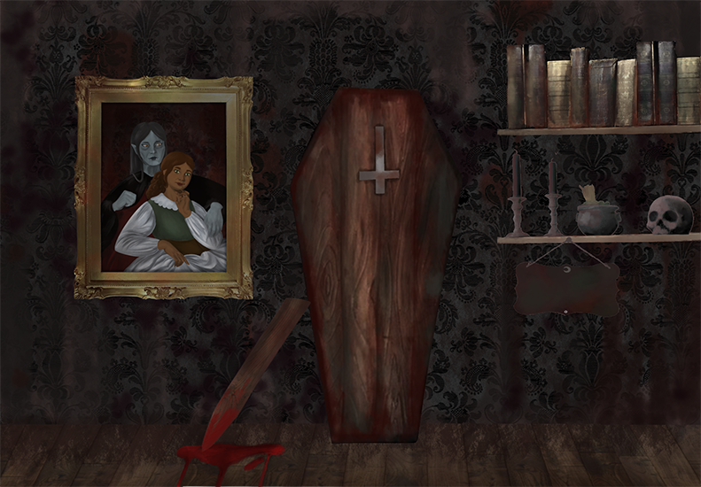
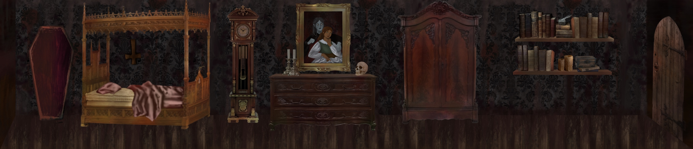
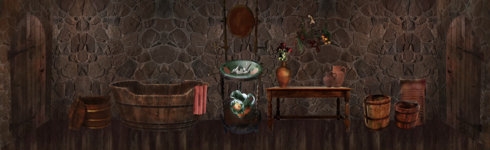
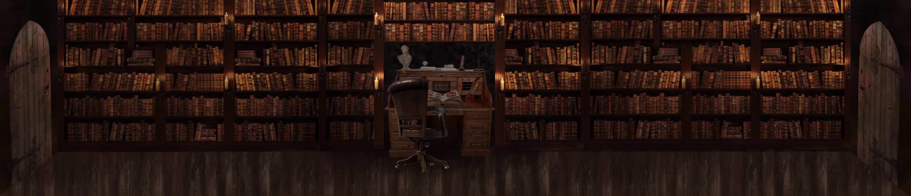
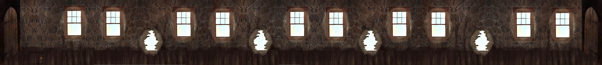
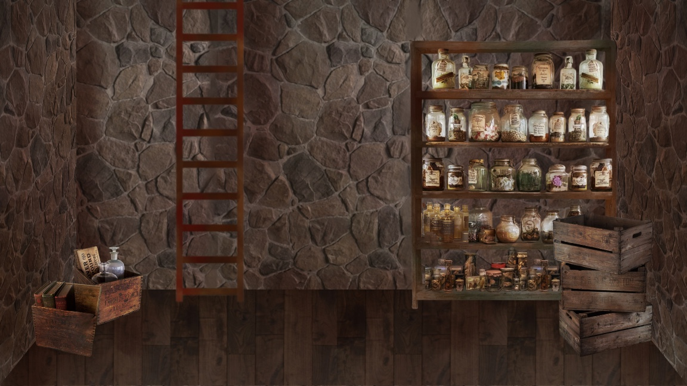
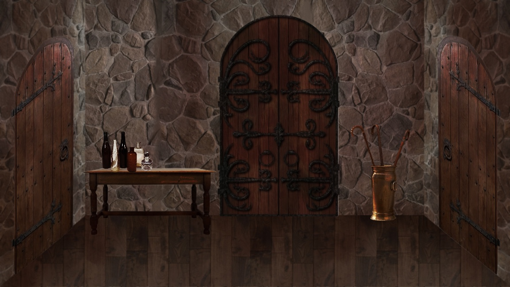
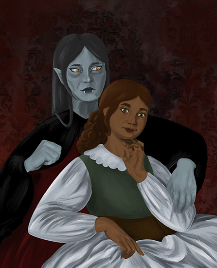

## Hambre y Sacrificio

Proyecto de Creación Multimedia Interactiva de la  Facultad de Bellas Artes de la Univesidad de Granada

# 1 Datos 

**Titulo** : Hambre y Sacrificio

**Web:**   (https://jmarball.github.io/Hambre-y-Sacrificio/)

**Enlace a Itch.io:** https://julia7mb.itch.io/hambre-y-sacrificio

**Autor:**  Julia Martínez Ballesteros

**Resumen** : "Hambre y Sacrificio" es un videojuego de aventura gráfica interactiva en 2D de corte gótico y misterio. La historia sigue a Camelia, una vampira que no recuerda nada de las últimas semanas, en la búsqueda de su novia, Yara, dentro de un lúgubre castillo. A través de la exploración de diferentes estancias, la resolución de puzles y la recolección de 8 objetos clave (como cartas ocultas o llaves), se van desentrañando los sucesos anteriores relacionando el vampirismo con el deber, la pérdida de la humanidad y los sacrificios que hacemos por amor. 

**Estilo/género:**  Aventura gráfica / Novela visual interactiva / Misterio Gótico.

**Logotipo** : (Titulo.png)

**Resolución:** 1152x648px 

**Probado en:** Google Chrome

**Tamaño proyecto:** 14MB 

**Licencia** Este proyecto tiene una Licencia CC Reconocimiento Compartir igual (CC BY-SA)

**Fecha** : 27/05/2026

**Medios** (donde se tiene presencia relacionada):

- Github:  (https://jmarball.github.io/Hambre-y-Sacrificio/)

# 2. Memoria del proyecto 

Una vampira (Camelia) despierta sin recuerdos en un castillo oscuro. Va buscando por las habitaciones pistas para descubrir qué le pasó antes de olvidar. Descubre que una cazadora de vampiras llegó a su hogar para matarla, pero en su lugar, asesinó a la pareja humana de Camelia (Yara), lo que causó la huída de la cazadora y el olvido por shock de la vampira. Va recordando todos estos sucesos poco a poco, junto con otras cosas como su sed insaciable de sangre, lo que la llevó a la locura; o la traición de su amada, que fue quien llamó a la cazadora, no para matarla, si no para asustarla y que dejara de asesinar a sangre fría a tantas humanas con la excusa de su necesidad de alimentarse. Su plan sale mal, y Camelia podrá decidir si salir en busca de venganza o si la culpa la consumirá.

### 2.1 Storyboard: 

El proyecto se desarrolla a través de un viaje de tensión creciente dividido en las siguientes etapas narrativas:

1. **El Inicio:** Camelia despierta en un dormitorio oscuro, sin recuerdos de lo que pasó en las últimas semanas. Interactuando con los objetos, va descubriendo distintos objetos que le ayudan a recordar.

2. **La Investigación:** El jugador interactúa con el entorno. Al abrir cajones y compartimentos y realizar diversos minijuegos, descubre el Lore del juego; destaca el arreglo del espejo, en el que descubre sangre humana; o el hallazgo de una carta en la biblioteca firmada por un cazador ("E.V."), que descubre la posible traición de Yara.

3. **El Conflicto:** Se introducen minijuegos y mecánicas de bloqueo que el jugador debe resolver recolectando objetos (como llaves u otros coleccionables) para desbloquear el camino.

4. **El Desenlace:** Tras descubrir la muerte de Yara al final del juego, al encontrarse el cadáver en la última habitación, la torre, puede haber hasta cuatro finales distintos, según varias elecciones que se realizarán durante el juego:
   Se suicida con el sol, consumida por la pena y la culpa. Condiciones:
     te alimentas de la sirvienta
     eliges culparte por su muerte

   Se vuelve loca de ira, sales a buscar venganza, a por la cazadora. Condiciones:
     te alimentas de la sirvienta
     culpas a la cazadora

   Llega muy débil a la torre, ve el cadáver y se tumba a su lado, no te puedes mover cuando sale el sol. Condiciones:
     no te alimentas de la sirvienta
     eliges culparte por su muerte

   Llega muy débil a la torre, ve el cadáver pero no llega a ella, aparece la cazadora a rematar el trabajo, no puedes defenderte. Condiciones:
     no te alimentas de la sirvienta
     culpas a la cazadora

   
### 2.2. Esquema de navegación 

La estructura del juego es semi-lineal, permitiendo la libre exploración de las estancias centrales para la recolección de objetos, pero bloqueando el avance final hasta cumplir las condiciones de la historia. Hay nueve habitaciones distintas, que Camelia va recorriendo:

  1. **Habitación**

  2. **Baño**

  3. **Biblioteca**
(en desarrollo)

  4. **Pasillo**
(en desarrollo)

  5. **Sótano**
(en desarrollo)

  
  6. **Entrada**
(en desarrollo)

  
  7. **Cocina**
(en desarrollo)
  
  8. **Escaleras**
(en desarrollo)
  
  9. **Torre**
(en desarrollo)

# 3. Metodología

El desarrollo de *Hambre y Sacrificio* se ha guiado por principios de **Experiencia de Usuario (UX)** enfocados a la narrativa interactiva, buscando que la interfaz sea invisible para que el jugador se sumerja por completo en la atmósfera gótica del castillo.

## Etapa 1: Ideación de proyecto

**Investigación de campo** l proyecto se inspira en el resurgir de las aventuras gráficas *point-and-click* de misterio y en novelas visuales de corte clásico. Visualmente se nutre de referentes del romanticismo oscuro y la literatura gótica del siglo XIX. LA obra de Carmilla ha sido clave para el desarrollo. 

**Motivación de la propuesta** 

Este proyecto es interesante porque explora el videojuego como un medio expresivo capaz de transmitir emociones complejas como la melancolía, la pérdida y el suspense. Mediante la interactividad, el espectador deja de ser pasivo para convertirse en cómplice de la investigación de Camelia.

**Publico / audiencia**

Orientado a jóvenes y adultos interesados en las narrativas de misterio, las aventuras gráficas independientes y los relatos con un fuerte peso estético y literario.

## Etapa 2: Desarrollo / actividades realizadas

Para materializar la experiencia de juego en Godot Engine 4, se implementaron soluciones de programación modulares y reutilizables:

* **Mecánica de exploración e interacción:** Se crearon nodos interactivos (`Area2D`) para el mobiliario del castillo. Al hacer clic sobre ellos, cambian su textura visual (mostrando que el mueble se abre) y activan la secuencia de eventos.
  
* **Sistema Dinámico de Diálogos:** Se diseñó una `CajaDialogo` centralizada. Para resolver la lectura de fragmentos largos (como la carta del cazador E.V.), los textos se fragmentaron en un `Array[String]`. El código extrae y envía las cadenas de texto individualmente para no saturar la pantalla, permitiendo que el jugador avance página por página a su propio ritmo.
  
* **Integración Visual en Interfaz:** Se programó el sistema para que, al leer documentos del inventario o coleccionables especiales, la interfaz inyecte la textura del objeto (`Texture2D`) como fondo fijo del cuadro de diálogo.
  
* **Diseño de Sonido Global (Polifonía):** Se implementó un gestor de audio centralizado (*Autoload*) llamado `SonidosGlobales`. Este sistema precarga los efectos en memoria y genera reproductores dinámicos en tiempo real para tres situaciones clave: un clic suave de papel para los menús, un crujido pesado de madera para los muebles y un destello melódico para el hallazgo de coleccionables. Al finalizar el sonido, los reproductores se autodestruyen para optimizar el rendimiento.

## Etapa 3: Problemas identificados

Es aún un proyecto en desarrollo, por lo que aunque tiene algún error, se irán arreglando hasta su versión definitiva.

# 4. Conclusiones 

*Hambre y Sacrificio* demuestra el potencial de Godot Engine 4 para crear experiencias narrativas inmersivas con un peso académico y artístico. El desarrollo ha permitido comprender la importancia del diseño de sonido diegético y la correcta gestión de la memoria del software.

Como trabajo futuro, y una vez esté terminado hasta mi planteamiento inicial, me gustaría expandir el proyecto en las siguientes líneas:

1. Implementar un sistema de guardado automático que conserve los 8 objetos de la colección entre diferentes sesiones de juego.
2. Añadir animaciones mediante *shaders* para simular el parpadeo de las velas en las estancias y dar más dinamismo a los fondos.
3. Ampliar el árbol de decisiones para permitir múltiples finales dependiendo de qué coleccionables haya logrado descifrar el jugador.

# 5 Referencias 

**Referentes:**
-Carmilla, de J. Sheridan Le Fanu
- Garfield, Scary Scavenger Hunt
- The Last Door
- Fran Bow
- Castlevania: Symphony of the night

**Recursos y materiales audiovisuales:**

* **Motor de desarrollo:** [Godot Engine 4.x](https://godotengine.org/) (Licencia MIT).
* **Música:** Paula González Fernández
* **Efectos de Sonido:** Repositorios de uso libre con licencia Creative Commons (Freesound.org).
* **Tipografías:** Fuentes de estilo serif clásico obtenidas de Google Fonts (Licencia Open Font).
* **Gráficos e Ilustraciones:** Diseños originales y texturas digitales obtenidas de Pinterest adaptadas.

**Herramientas utilizadas**

- Godot Engine 4.x

  
  </small>

Mayo 2026
